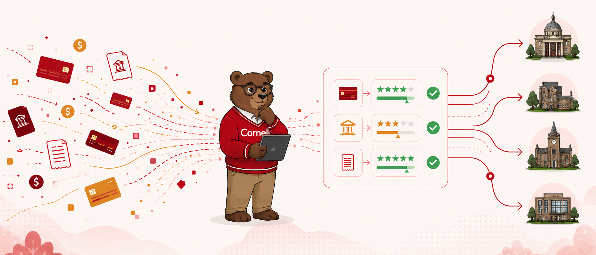
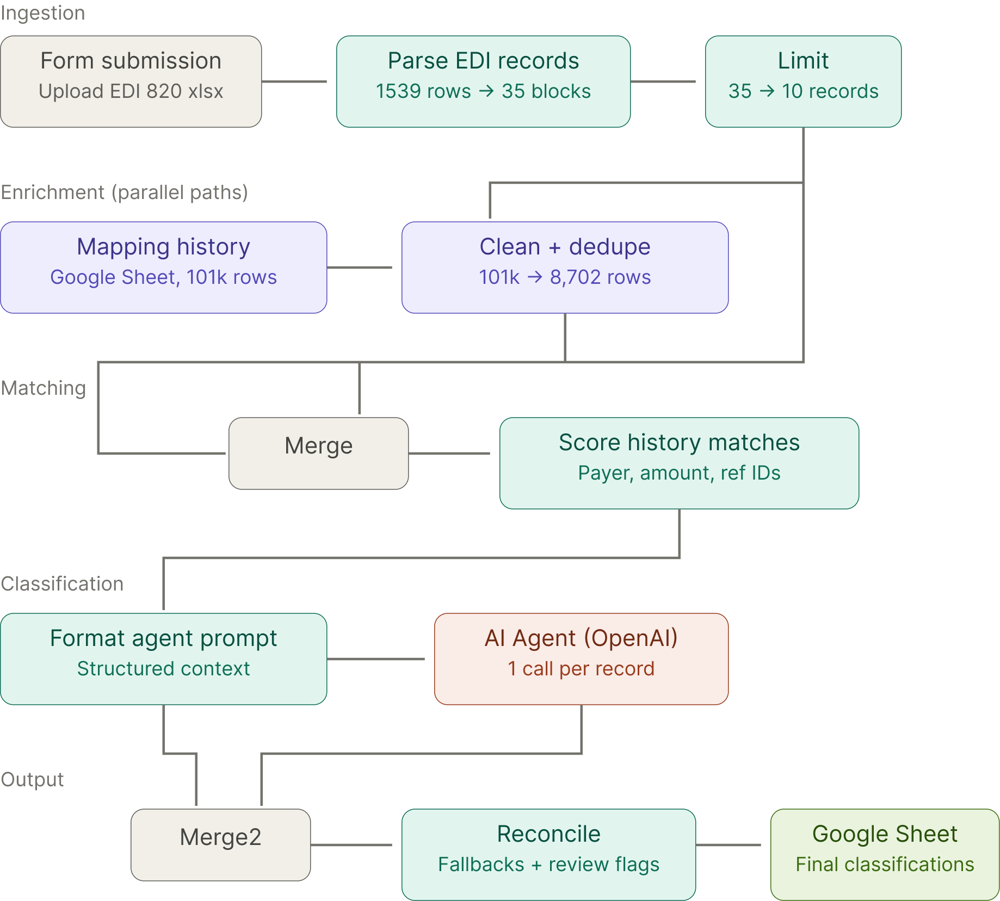
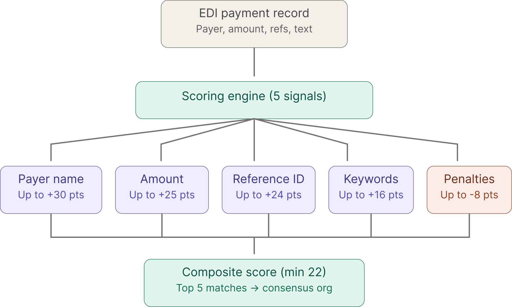

# Classify Cornell Unidentified Payments - AI Experiment
> Cornell University. Spring 2026. AI Innovation Lab Project.

Client: Department of Cornell Treasury  

## Problem

Cornell Treasury receives incoming payments daily - ACH transfers, wire payments, and other electronic funds - through EDI reports exported from Kyriba. Many of these payments arrive with vague or missing information: truncated company names, no invoice references, and no indication of which Cornell department should receive the funds.  

Today, Treasury staff manually investigate each unidentified payment. They open the spreadsheet, Google the vendor name, search through historical emails in a shared Outlook inbox, and sometimes call or email multiple departments asking "Are you expecting a payment from this company?" A single payment can take 30–40 minutes to resolve. With 282 unidentified payments in a recent batch, that's roughly 150 hours of manual work - with no batch processing and no way to learn from past cases.

## Our Solution

We built an automated pipeline that takes the same EDI Report Treasury already exports from Kyriba and classifies each payment to a Cornell department in seconds instead of hours.  

The system works in three stages: it parses the raw EDI data into structured payment records, scores each payment against 8,700+ cleaned historical GL transactions using a multi-signal ranking algorithm, and then uses an LLM (GPT-4o) to classify the department with the historical matches as context. The output is a Google Sheet where each row shows the identified payer, recommended department, confidence score, and a review flag. Staff only need to manually review the uncertain cases - the system handles the rest.

## Architecture

### High Overview

The pipeline runs in n8n as two parallel paths within a single workflow. A daily scheduled job reads 101,000+ historical GL records from Google Sheets, cleans and deduplicates them down to ~8,700 rows, and caches the result. When a user uploads an EDI file through a web form, the system parses it into payment blocks, merges them with the cached history, scores matches, formats structured prompts for the AI agent, and reconciles the AI's output with the deterministic scoring results. Final classifications are written to a Google Sheet.

    

### History Ranking Algorithm

The scoring engine is the core of the system. Rather than sending raw payment data to an LLM and hoping for accurate classification, we first run a deterministic matching pass against historical records using five weighted signals:  
- Payer name similarity (up to +30 pts) - company names are normalized (stripping "LLC", "Inc", etc.) and compared using substring matching and token-level similarity.
- Amount matching (up to +25 pts) - tiered scoring from exact match down to within $100.
- Reference ID cross-matching (up to +24 pts) - invoice numbers, trace numbers, and leading numeric IDs from GL descriptions are extracted and compared.
- Keyword overlap (up to +16 pts) - meaningful word intersection between the EDI text and GL descriptions, with stop words removed.
- Generic pattern penalty (up to -8 pts) - history rows with vague descriptions like "incoming ACH" are penalized to prevent false positives.

    

Only matches scoring >= 22. The top 5 are deduplicated and a weighted consensus department is computed. This consensus, along with the match details, is passed to the AI agent as structured context - the LLM confirms or overrides, but it never starts from scratch.

### Demo
Project Presentation + Demo: [Video ↗](https://drive.google.com/file/d/1fiqez93eWJr22FoW7oUTJc4hdSQqJ-pV/view?usp=sharing)  
Slide Deck: [Power Point Presentation ↗](https://drive.google.com/file/d/1ILw9_e2XH4-LqLPLCTXSFpbxkZUkDH3z/view?usp=sharing)  

## How to setup and run?

1. Import the workflow JSON (`workflows/edi-payment-classifier.json`) into your n8n instance
2. Configure Google Sheets OAuth2 credentials in n8n
3. Set up a Google Sheet with three tabs: `ur-history` (source GL data), `ur-history-cache` (daily cleaned cache), and `edi-payment-classifications` (output)
4. Run the Schedule Trigger path once manually to populate the history cache
5. Open the form trigger URL in a browser, upload an EDI 820 Excel file, and submit
6. Review results in the `edi-payment-classifications` sheet - filter on `Needs Review = TRUE` for payments requiring manual attention.  

For detailed configuration, see the [technical documentation](./docs/technical-documentation.md) and [user guide](./docs/user-guide.md).

> For more information, checkout [limitations](./docs/limitations.md) and [future plans](./docs/future-plans.md).

---

### The Team

| Name | netID | Link |
| ---- | ----- | ---- |
| Sanjeev Ragunathan | sr2432 | [GitHub ↗](https://github.com/sanjeev-ragunathan) |
| Sruti Sri-Sai Gudapati | ssg98 | [Link ↗]() |
| Yaqi Liu | yl3879 | [Link ↗]() |

---

**Links** | [Project Repo - GitHub ↗](https://github.com/sanjeev-ragunathan/Cornell-Treasury-Automation) | [Website ↗](https://sanjeev-ragunathan.github.io/Cornell-Treasury-Automation/) | [Presentation - Video ↗](https://drive.google.com/file/d/1fiqez93eWJr22FoW7oUTJc4hdSQqJ-pV/view?usp=sharing) | [Slide Deck - PPT ↗](https://drive.google.com/file/d/1ILw9_e2XH4-LqLPLCTXSFpbxkZUkDH3z/view?usp=sharing)  

---

> Copyright (c) 2026 Sanjeev Ragunathan, Sruti Sri-Sai Gudapati, Yaqi Liu. MIT License.
